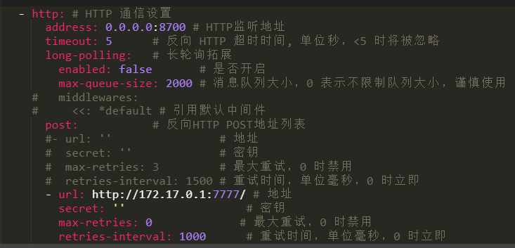
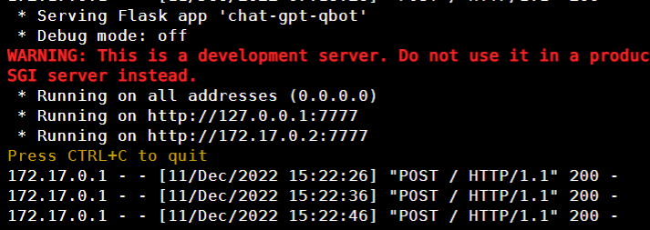
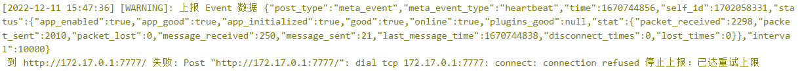

> 最近很火的ChatGPT模型对接QQ，其中的主要程序来自b站up主[呆呆木T](https://space.bilibili.com/50791870)，博客地址<https://lucent.blog/>，侵删
> 前置条件1：openAI帐号
> 前置条件2：科学上网环境

傻妞插件openAI不是ChatGPT，是同一家公司出的两个不同的模型，不要搞混了

## 安装QQ端

请参考[安装go-cqhttp](/sillygirl/install-go-cqhttp.html)

需要修改配置文件，在最下面添加http通信设置，注意缩进

```Shell
  - http: # HTTP 通信设置
      address: 0.0.0.0:8700 # HTTP监听地址
      timeout: 5      # 反向 HTTP 超时时间, 单位秒，<5 时将被忽略
      long-polling:   # 长轮询拓展
        enabled: false       # 是否开启
        max-queue-size: 2000 # 消息队列大小，0 表示不限制队列大小，谨慎使用
       middlewares:
         <<: *default # 引用默认中间件
      post:           # 反向HTTP POST地址列表
      #- url: ''                # 地址
      #  secret: ''             # 密钥
      #  max-retries: 3         # 最大重试，0 时禁用
      #  retries-interval: 1500 # 重试时间，单位毫秒，0 时立即
      - url: http://172.17.0.1:7777/ # 地址
        secret: ''                  # 密钥
        max-retries: 0             # 最大重试，0 时禁用
        retries-interval: 1000      # 重试时间，单位毫秒，0 时立即
```



> 请注意：`address`的端口和`url`的端口都不能与其他程序的端口冲突

对于已经添加过`access-token`的，需要注释如图两行,取消引用默认中间件

如果chatgpt与go-cqhttp在同一台机子上，可以如图设置`url`，否则需要按实际情况修改

## 部署ChatGPT

我将作者的项目打包成镜像了，方便部署，侵删

首先创建一个目录，在目录下新建一个文件`config.json`

```Text
{
    "chatGPT": {
        "session_token": "",
        "email": "",
        "password": ""
    },
    "qq_bot": {
        "qq_no": "123456",
        "cqhttp_url": "http://172.17.0.1:8700",
        "max_length": 9999,
        "image_path": "../QBot/data/images"
    },
    "text_to_image": {
        "font_size": 30,
        "width": 700,
        "font_path": "fonts/sarasa-mono-sc-regular.ttf",
        "offset_x": 50,
        "offset_y": 50
    }
}
```

配置解释：

- `session_token`即相当于你的Cookie，有有效期，不使用token建议使用下面的帐号密码
- `email`openAI的帐号 如果使用token则留空
- `password`密码 如果使用token则留空
- `qq_no`对接的QQ号
- `cqhttp_url`go-cqhttp的IP地址:端口，这里是因为go-cqhttp在本机所以这么填写
- `max_length`填写9999表示使用文字回复，填写0表示转成图片回复
- 其他的不要动


在该目录下启动容器命令，建议在国外vps上部署，经测试，如果chatgpt与qq端不再一台机子上，可能会无法连通，暂不清楚是哪里的问题

```Shell
docker run -dit \
--name chatqq \
--network=host \
--restart=always \
-v "$(pwd)"/config.json:/app/config.json \
dswang2233/chatqq
```

等待启动完成，查看日志

```Shell
docker logs -f chatqq
```



可以看到post 200 等字样说明连接成功了

直接私聊QQ机器人或者群里@机器人就可以了



如果出现如图的黄字提醒不要紧，不影响使用

> 参考[使用Python对接OpenAi APi 实现智能QQ机器人(三) - 搭建QQ机器人](https://lucent.blog/?p=99)
> 常见问题解答[为什么机器人对接Api之后回答速度没有官网网页上速度快？](https://lucent.blog/?p=100)
