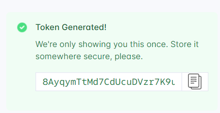
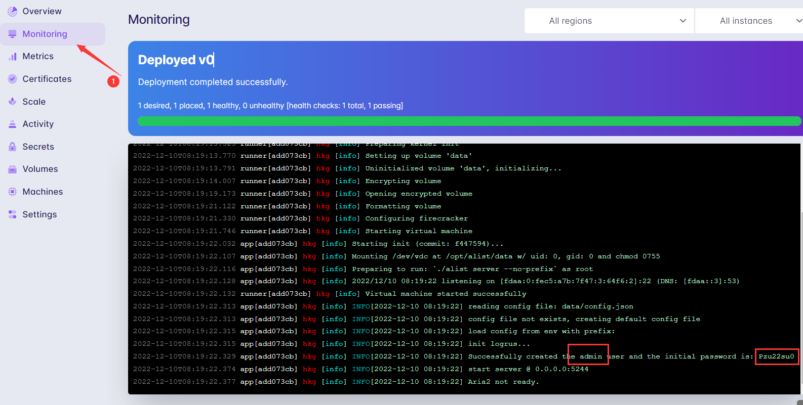

准备在写文章时分享文件的，结果找了几个网盘，不是限速就是限分享，或者限时长、大小等等，决定自己搭建一个网盘呈现，于是找到了Alist，[项目地址](https://github.com/alist-org/alist)，虽然早就知道了大名鼎鼎的Alist，不过还没试过，正好有机会体验一把

为了将白嫖进行到底，我选择使用 [fly](https://fly.io/) 加 GitHub Action 部署。

> 请注意，不要滥用免费资源！！！请注意，不要滥用免费资源！！！
> fly可能需要绑定信用卡，没有信用卡或者不愿意绑定的请去项目地址按照其他方式部署

## 开始

### 注册并获取Token

访问 [注册页面](https://fly.io/app/sign-in) 注册fly的帐号，也可以直接用GitHub帐号链接。注册时可能要求绑定信用卡，或者稍后在Billing中绑定

注册成功自动跳转到控制台页面，鼠标移动到右上角 `Account`，下拉点击 `Access Tokens`


在右边输入框随意输入一个Token名称，点击按钮 `Creat` 创建一个新Token


然后右边就会出现Token，注意保存，待会儿要用



## 初始化

### 安装

在Linux上安装fly命令行工具

```Shell
curl -L https://fly.io/install.sh | sh
```

其他系统

```macOS
brew install flyctl #MacOS
```

```Powershell
iwr https://fly.io/install.ps1 -useb | iex #Windows
```


如图提示，添加到系统环境变量

```Shell
export FLYCTL_INSTALL="/root/.fly" #如果你不是在root目录下安装的，按实际情况修改
export PATH="$FLYCTL_INSTALL/bin:$PATH"
```

因为已经上面已经注册了，这里直接登录

```Shell
flyctl auth login
```

复制括号内连接到浏览器打开，选择连接你的账户，终端会自动完成


### 创建应用

```Shell
flyctl launch
```

第一步直接回车，第二步填写应用名称，请注意，您只能使用数字、小写字母和短划线。


第三步选择部署的区域，我这里选择香港，键盘方向键上下选择，回车选中


然后会分别询问是否使用Postgresql数据库、是否使用Redis数据库和是否立即部署

```Shell
? Would you like to set up a Postgresql database now? (y/N)
? Would you like to set up a Redis database now? (y/N) #这一行忘记了
? Would you like to deploy now? (y/N) 
````

全部选择 `No`

创建一个 1G 的持久存储空间(最小单位 1)

```Shell
flyctl volumes create data --size 1 --app APP_NAME #此处填写上面创建时输入的名称
```

## GitHub Action部署

### 使用我的模板

访问 [我的模板地址](https://github.com/callacat/fly-Alist)。点击右边绿色按钮`Use this template`再点击`Create a new repository`使用该模板.

仓库创建完成后点击 `Settings`->`Secrets`->`Actions`，点击 `New repository secret`创建一个新密钥


name填写 `FLY_API_TOKEN`，Secret填写第一步创建的token


点击`Add sercret`保存。如何启用Action略过

修改`fly.toml`文件，将第一行的值修改为你的应用的名称，保存

以上步骤正确的话将会自动在fly构建应用。

每当你修改某文件并推送时，会自动触发更新，同时我也设定了每周五早上8点更新(UTC时间)。

如果需要管理文件，在拥有`fly.toml`的设备上执行命令

```Shell
flyctl ssh console
```

### 使用

访问[控制面板](https://fly.io/dashboard/)，在Apps可以看到刚才创建好的应用，点进去

`Overview`中显示自动分配的域名`https://APP_NAME.fly.dev`，点击访问，如果暂时打不开过一两分等待dns解析再打开。每次部署后可能都需要一两分钟才能再次打开

点击`Monitoring`，在右边的窗口可看到日志，帐号和密码就在其中



登录Alist之后记得修改帐号密码

> 参考：[在 Fly.io 上部署 alist 网盘程序](https://cuojue.org/read/deploy-alist-in-flyio.html)