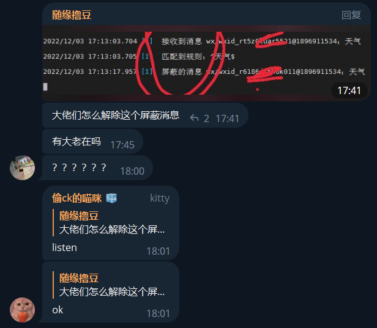
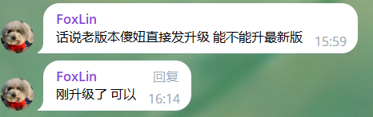
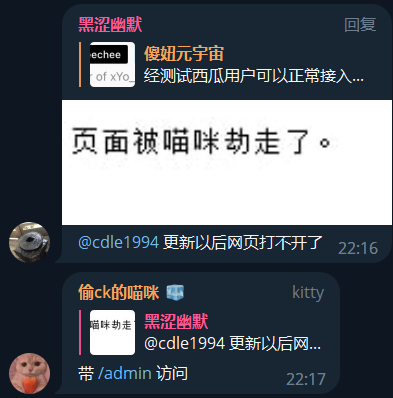

以下问题是我看到的常见的问题，如果没有你遇到的问题，或者你觉得我的回答不对，忍着

## 我在哪里可以找到傻妞官方客服？

  - 没有客服，滚
    

    
但是有其他联系方式

    <pre>
        - TG频道 <a href="https://t.me/kczz2021">傻妞元宇宙</a>
        - TG群组 <a href="https://t.me/trialerr">好好学习群</a>
        - QQ群组 <a href="https://jq.qq.com/?_wv=1027&k=rtL5kSVO">傻妞技术交流群</a> PS:近乎死群
        - 微信群组 PS:早就死群了
        - 项目地址 <a href="https://github.com/cdle/sillyGirl">https://github.com/cdle/sillyGirl</a> PS：没什么用，只能下载最新版本
    </pre>
    

## 如何正确的提问？ 

  - 请先尝试理解本系列文章下的所有内容，通常情况下可以解决大部分问题

  - 首先作者or群友or网友不是你的免费保姆，提问前请放平心态

    

    
提问请携带以下内容

    <pre>
      - 准确描述问题
      - 你的尝试记录
      - 交互界面对话截图
      - 傻妞后台日志截图
      - 傻妞web面板F12截图
      - 必要时候提供服务器连接方式给作者进行诊断
    </pre>
    

## 什么是交互界面

  

  
在傻妞生态系统中，交互界面特指与傻妞的交互窗口，包括：

  <pre>
  - ssh终端交互
  - 各平台机器人聊天窗口
  - web面板右下角交互界面
  </pre>
  

## 是否有arm32位版

  没有，下一个

## 为什么我一启动就提示被 **killed/杀死** 呢
  

  
那是因为你用同样的方式启动了两次，第二次就会被杀死

  <pre>
    - 解决方法也很简单，杀死以前的傻妞，重新启动就好了，至于怎么操作，取决于你是什么样的启动方式，参考
    - 或者换Docker版
  </pre>
  

## 为什么我发命令傻妞没有响应，是不是被玩坏了

  - 是的呢，建议卸载
    

    
或者用排除法，大部分问题都可以用此排除法解决

    <pre>
      1. 首先你要知道傻妞是否有你发送的命令，去已安装插件查看
      2. 你应该检查你是否对接各平台正常，也就是收发消息是否正常
      3. 如果傻妞本体版本与插件版本相差过大也会出现这种情况
      4. 如果是ssh终端交互模式，确定你是不是在交互模式启动的，即 -t
    </pre>
    

## 为什么在tg平台别人发命令没有响应

  - 先发送 listen

  

  - 不行查看上一条和下一条

## 为什么我QQ发消息没反应啊

  

  
点击查看答案

  <pre>
    - 某些命令仅限管理员使用
    - 某些插件设置了仅在某些平台生效
    - 尝试 
    - 或者查看上两条
  </pre>
  

## 为什么QQ群消息无法撤回啊
  

  
点击查看

  <pre>
    - 需要傻妞控制的QQ机器人有撤回权限，设置为群管理即可
    - 插件需要有撤回机制
  </pre>
  

##  我忘了我的web帐号密码怎么办
  

  
建议删库跑路

  <pre>
      #设置账号
      set silly name xxxx
      #设置密码
      set silly password xxxx
      #查看账号
      get silly name
      #查看密码
      get silly password
  </pre>
  

##  为什么你都是用Docker部署

  因为方便，懂得都懂

##  微信服务号怎么xxxx

  管理员在服务号发送 `wxsv init`

##  为什么使用oicq登录提示当前QQ版本过低？

  那是QQ的事，与傻妞无关，建议 [安装go-cqhttp](install-go-cqhttp.html)

##  旧版傻妞是否可以直接发送命令升级到最新版？

  

  建议升级前备份数据库

##  为什么我登录QQ框架/微信框架提示被风控/冻结/封号

  腾讯的问题，与傻妞无关。建议换号或者放弃

## 傻妞的相关文件在哪里

  傻妞的相关文件分别在两个地方，一个是本体所在的目录 `/use/local/sillyGirl`，一个是数据库所在目录 `/etc/sillyGirl`，对于我的镜像来说都在 `"$(pwd)"`映射目录下能找到

  先来看本体所在目录

  - /use/local/sillyGirl

    - sillyGirl #傻妞本体

    - conf/ #旧版遗留下来的配置文件目录，已弃用

      - config.yaml

  然后是数据库所在目录

  - /etc/sillyGirl

    - scripts/ #旧版存放脚本的目录，已弃用

    - public/ #旧版存放插件和插件配置文件的目录，已弃用

      - download/ #未知作用

      - list.json #未知作用

    - sillyGirl.cache #傻妞的数据库

## 为什么有些插件别人的傻妞正常但是我不能用？
  

  
点击查看

  <pre>
    - 升级插件
    - 部分插件需要申请key，去插件注释查看
  </pre>
  

## 网页web面板打不开/页面被喵咪劫走了

  

## 这里没有我遇到的问题？

点击显示答案

<pre>
请查看<a href="#section1">如何正确的提问？</a>或者放弃使用傻妞，推荐使用奥特曼

</pre>

