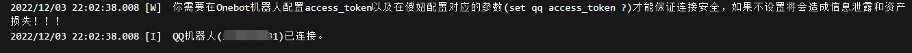
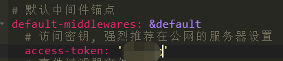
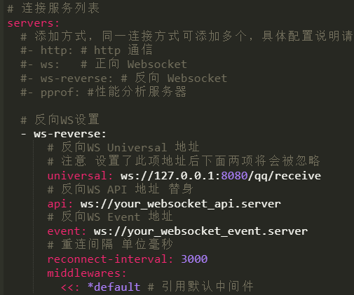
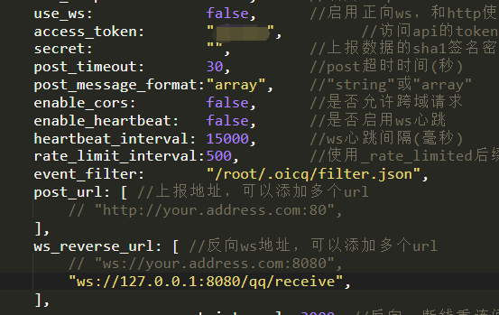

> 此记录基于2022年12月2号的版本，在此之前或之后的版本仅供参考。以下任何命令如果没有说明则表示是在交互界面执行。

> 首先，你必须正确安装傻妞，请参考 [从得到到抛弃](getToThrow.html)
然后，你需要完成中的 [安装oicq](install-oicq.html)或[安装go-cqhttp](install-go-cqhttp.html)
PS: 理论上实现了 [onebot](https://github.com/botuniverse/onebot-11) 协议的QQ机器人框架都可以对接傻妞，不过目前主流的还是这俩，推荐go-cqhttp

## 初始化设置

### 安装必要插件

在插件市场找到 CQ码 插件安装，部分插件是需要这个插件做依赖的。

### 设置管理员

注意，此“管理员”指的是对傻妞的管理者，而不是QQ群的管理员

```Shell
set qq masters qq1&qq2 ##可以设置多个用&隔开
```

### 设置token

```Shell
set qq access_token <自定义>
```

如果不设置将会提示风险，建议设置



## 对接go-cqhttp

在go-cqhttp配置文件找到`access-token`，填写上一步设置的 access-token



然后在最后面找到`ws-reverse`，修改`universal`的值，注意IP和端口需要根据你的实际情况修改

```Shell
  - ws-reverse:
      ## 反向WS Universal 地址
      ## 注意 设置了此项地址后下面两项将会被忽略
      universal: ws://傻妞IP:8080/qq/receive
      ## 反向WS API 地址 忽略
      api: ws://your_websocket_api.server
      ## 反向WS Event 地址 忽略
      event: ws://your_websocket_event.server
      ## 重连间隔 单位毫秒
      reconnect-interval: 3000
      middlewares:
        <<: *default ## 引用默认中间件
```



重启go-cqhttp，当你看到傻妞日志输出 

```Plain Text
2022/12/03 22:02:38.008 [I]  QQ机器人(123456789)已连接。
```

表示连接正常

## 对接oicq

oicq对接方式是一样的，区别只是配置文件修改的位置不同

打开oicq的配置文件`config.js`，找到`access_token`，同样修改为上面设置的 access_token

然后在`ws_reverse_url`中填写傻妞的对接地址



随后重启oicq

## 你有很多疑问？

请访问[常见问题Q&A](Q&A.html)