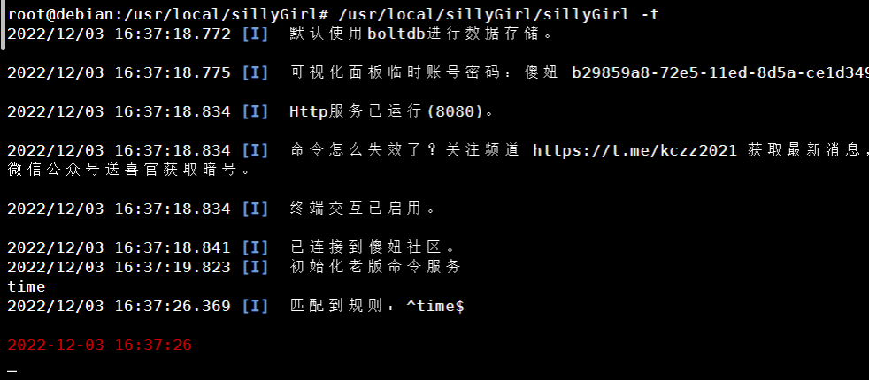
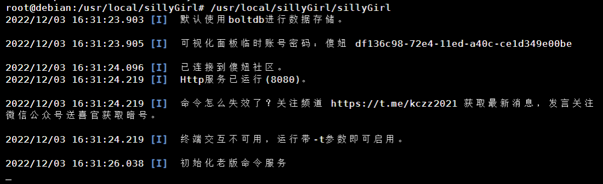
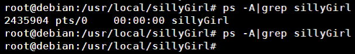
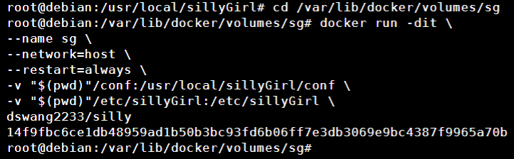
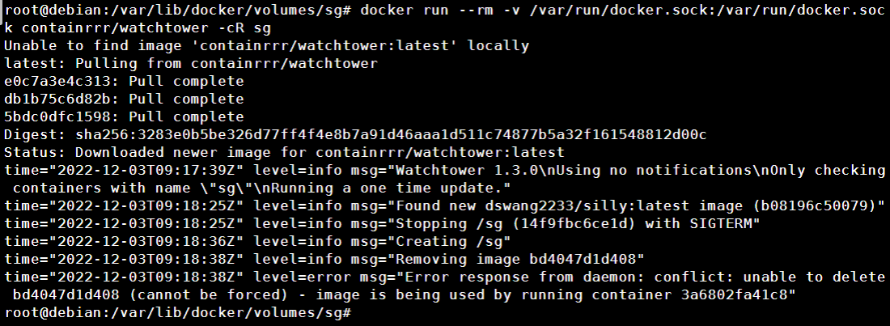

> “此记录基于2022年12月2号的版本，在此之前或之后的版本仅供参考。”

**以下所有命令均默认是在常见的amd64/arm64架构的系统上连接SSH执行，且拥有root权限**

## 一键安装

```Shell
bash <(curl -sSL http://app.imdraw.com/install.sh)
```

傻妞将自动下载到 `/usr/local/sillyGirl` 目录下，

### 进入终端交互

```Shell
/usr/local/sillyGirl/sillyGirl -t
```



按住 `Ctrl + c` 退出终端交互模式

### 仅看日志

```Shell
/usr/local/sillyGirl/sillyGirl
```



按住 `Ctrl + c` 退出

### 后台运行

```Shell
/usr/local/sillyGirl/sillyGirl -d
```

此命令启动后无法看日志

### 停止运行 

```Shell
ps -A|grep sillyGirl ###显示进程号
kill -9 xxxxxx ###杀掉进程，精准打击?
```



### 添加自启

参考懒羊羊小姐姐的教程，仅限使用systemd服务的系统

[Linux系统服务systemd进程守护之sillyGirl实践 - 科技玩家](https://www.kejiwanjia.com/jiaocheng/zheteng/notes/74594.html##systemctl)

### 卸载傻妞

先执行上面的[停止运行](###停止运行)，再执行以下命令

```Shell
rm -rf /usr/local/sillyGirl ###删除傻妞本体
rm -rf /etc/sillyGirl ###删除数据库
```

## Docker部署

> 我将使用我自己打包的镜像做示例，详细信息请进入 [仓库地址](https://hub.docker.com/r/dswang2233/silly) 查看，如果使用其他大佬打包的镜像以下信息不通用

注意：以下所有 **容器名、映射目录** 必须前后一致

新建一个目录，进入此目录后执行

```Shell
docker run -dit \
--name sillyGirl \
--network=host \
--restart=always \
-v "$(pwd)"/conf:/usr/local/sillyGirl/conf \
-v "$(pwd)"/etc/sillyGirl:/etc/sillyGirl \
dswang2233/silly
```


为了截图我修改了容器名为 **sg**

将自动在后台运行且随Docker服务自启

### 查看日志

```Shell
docker logs -f sillyGirl
```

### 停止运行

```Shell
docker stop sillyGirl
```

### 更新

```Shell
docker run --rm -v /var/run/docker.sock:/var/run/docker.sock containrrr/watchtower -cR sillyGirl
```


为了截图我修改了容器名为 **sg**

### 卸载

```Shell
docker stop sillyGirl ###首先停止运行容器
docker container rm sillyGirl  ###删除容器
docker imagerm dswang2233/silly  ###删除镜像
rm -rf "$(pwd)" ###删除映射目录
```

### 管理

推荐使用 Poetainer管理 [安装portainer](install-docker/install-portainer.html)

## 傻妞的文件在哪里
