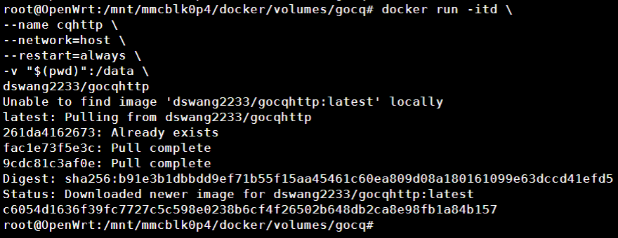
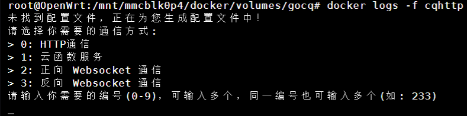
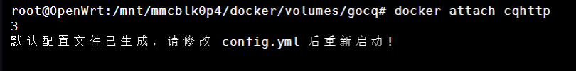
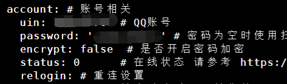
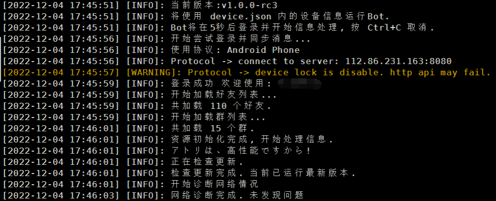

go-cqhttp项目地址 <a name="section1"></a>

[GitHub - Mrs4s/go-cqhttp: cqhttp的golang实现，轻量、原生跨平台.](https://github.com/Mrs4s/go-cqhttp)

> 还是我打包的镜像，仓库地址[dswang2233/gocqhttp](https://hub.docker.com/r/dswang2233/gocqhttp) ，以下内容仅适用于我的镜像，不适用于其他大佬的镜像。

# Docker安装

> 需要其他安装方式的请访问上面的项目地址

新建一个目录，进入目录ssh下执行

```
docker run -itd \
--name cqhttp \
--network=host \
--restart=always \
-v "$(pwd)":/data \
dswang2233/gocqhttp
```



## 查看日志

```Shell
docker logs -f cqhttp
```



按住`Ctrl + c` 退出日志

## 交互

```Shell
docker attach cqhttp
```

输入数字 3 会在当前目录下自动创建配置文件



按住`Ctrl + c` 退出交互

## 修改配置文件

```Shell
nano config.yml
```
没有安装`nano`的把`nano`换成`vi`

建议使用密码登录



> 注意：每个冒号后面都有一个空格，再写QQ号。密码填写在两个单引号之间

按住`Ctrl + x`输入 `y`然后回车一下保存并退出编辑

按住`Ctrl + c`重启go-cqhttp

## 重启

```Shell
docker restart cqhttp
```



黄字提示无需在意 [为什么我登录QQ框架/微信框架提示被风控/冻结/封号](Q&A.html#为什么我登录qq框架微信框架提示被风控冻结封号)

## 卸载go-cqhttp

```Shell
docker stop cqhttp ##首先停止运行容器
docker container rm cqhttp  ##删除容器
docker imagerm dswang2233/gocqhttp  ##删除镜像
rm -rf "$(pwd)" ##删除映射目录
```

## 其他

想了解更多go-cqhttp的知识或者疑难解答，请猛击 <a href="#section1">go-cqhttp项目地址</a>

# 对接傻妞

[对接QQ](QQ.html)