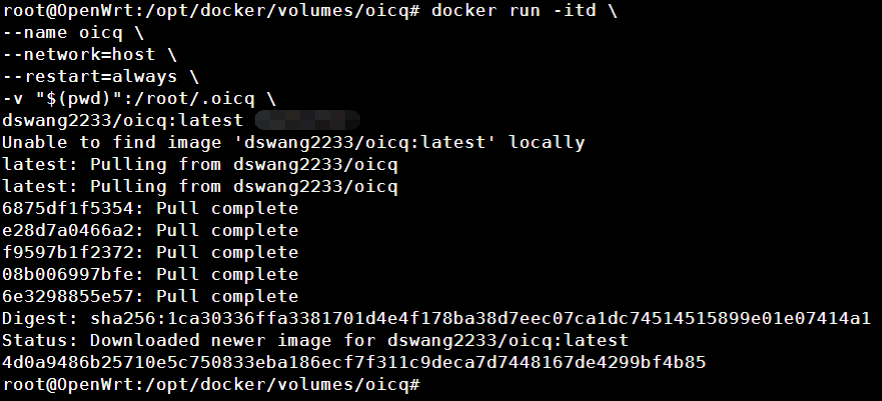
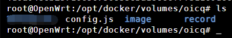
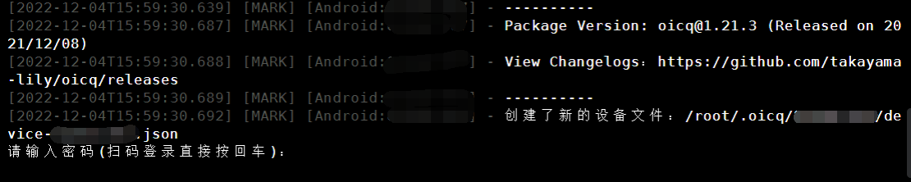
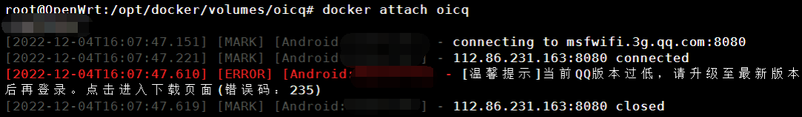

> node-onebot就是旧版的oicq
个人推荐[安装go-cqhttp](install-go-cqhttp.html)

oicq项目地址 <a name="section1"></a>

[github.com](https://github.com/takayama-lily/oicq/tree/master)

> 依然是使用我自己打包的镜像 仓库地址 [dswang2233/oicq](https://hub.docker.com/r/dswang2233/oicq)，以下内容仅适用于我的镜像，不适用于其他大佬的镜像。

# Docker安装

> 需要其他安装方式的请访问上面的项目地址

新建一个目录，进去执行

```Shell
docker run -itd \
--name oicq \
--network=host \
--restart=always \
-v "$(pwd)":/root/.oicq \
dswang2233/oicq:latest QQ号
```


打码的地方是QQ号

此时当前目录下自动生成了配置文件



## 查看日志

```Shell
docker logs -f oicq
```



此时可以看到要求登录，按住 `Ctrl+ c`退出日志

## 交互模式

```Shell
docker attach oicq
```

进入交互模式后输入密码，推荐密码登录，如果你想扫码登录直接回车



按住 `Ctrl+ d`退出，此时oicq会重启且在后台运行，不用管了。

[为什么使用oicq登录提示当前QQ版本过低？](Q&A.html#为什么使用oicq登录提示当前qq版本过低)

## 卸载oicq

```Shell
docker stop oicq ##首先停止运行容器
docker container rm oicq  ##删除容器
docker image rm dswang2233/oicq  ##删除镜像
rm -rf "$(pwd)" ##删除映射目录
```

## 其他

想了解更多 oicq 的知识或者疑难解答，请猛击 <a href="#section1">oicq项目地址</a>

# 对接傻妞

[对接QQ](QQ.html)