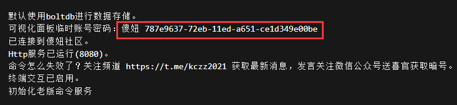
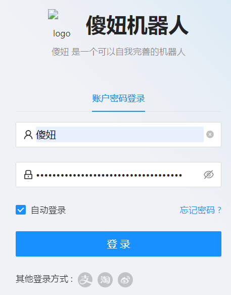
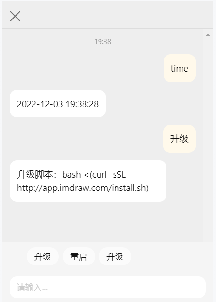
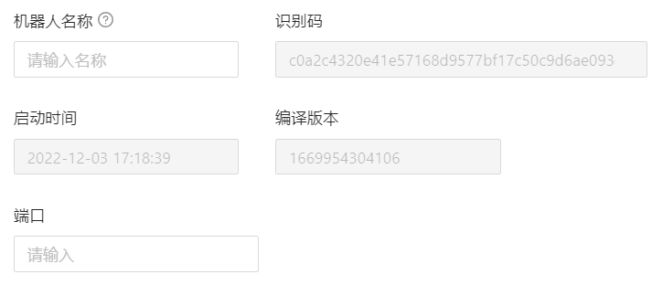
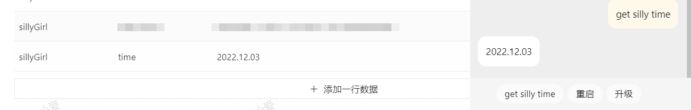
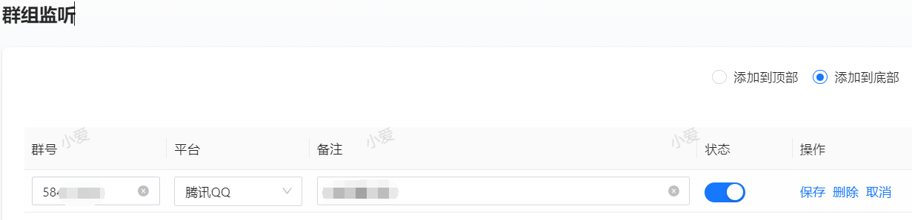
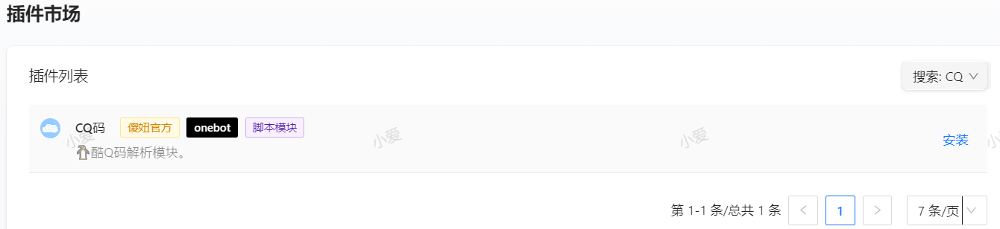
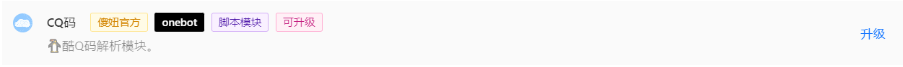

> “此记录基于2022年12月2号的版本，在此之前或之后的版本仅供参考。以下任何命令如果没有说明则表示是在交互界面执行。”。

> 首先，你必须正确安装傻妞，请参考 [从得到到抛弃](getToThrow.html)

访问 ip:8080/admin 进入web面板（如果是Docker部署的且修改了映射端口记得使用修改过的端口），帐号密码在ssh输入查看日志的命令可以看到 


其中“傻妞”就是帐号，后面的一串字符就是密码，不包括空格

输入帐号密码登录，建议勾选自动登录，并且让浏览器记住密码



# 交互

web自带交互窗口，类似ssh终端交互，在网页右下角有个会话图标，点开就是了


升级改成了手动升级

# 核心配置

## 系统参数



此处仅可修改两个地方

- 机器人名称就相当于登录帐号了，设置名称后网页右上角会出现名字

- 端口默认8080，如果改了记得用新端口登录，Docker的话需要修改启动命令，建议修改

## 存储管理

点击输入框即出现已有的所有的[桶]，每一个[桶]就相当于一张数据库内的表，点击选择一个即可查看。输入你想找的数据也可以快速找到。

下拉点击 添加一行数据 ，输入键名和值，点击保存，或者在交互界面发送 `set <桶名> <键名> <值>`立即给该桶添加数据。



在交互界面输入 `get <桶名> <键名>` 即可获得刚才添加的值。

删除桶需要在交互界面输入 `empty <桶名>`。非必要不建议使用。

# 群组管理

## 群组监听

添加到此处的群组才可以使用傻妞，未添加的群主哪怕是管理员也无法使用。

点击 添加一行数据，填入 群号，选择平台，填入备注，状态启用即可



注意TG群组的群号前面带 `-`，TG频道同

## 群组禁言

仅监听群主消息但不回复，适合机器人在返利采集群的时候使用，仅在群组监听生效的情况下有效

添加数据同上

# 返利配置

[返利配置](rebate.html)

# 插件管理

## 插件市场

此处可安装所有公开发布的插件，比如搜索 CQ，区分大小写



点击右侧 安装 即可安装到傻妞，在 可以查看。再次点击 卸载 即可卸载



有升级的时候打开插件市场点击升级即可

## 插件订阅

可以订阅第三方开发者开发的脚本，可以同时添加复数订阅链接，填写自动提交，刷新一下插件市场就出来了。下面分享一部分订阅链接

```Shell
#烟雨阁
sub://T4EywWN46ztYBhHNdOl6Ts9noWPR5fdOLy28xo+UM95dQmu4JrSmPllYIfQ3eshgNsVbPuTo2eyNfDX7tDLrNxGYTGSGNDeGLMJpBxS6UnS9p6wOtAS8uFPFm3u+f0EW/VKNPYHAxRYIFP4j30qCGeHBwKhcuDiRbJfokC8oUU0=
#红灯区
sub://T4EywWN46ztYBhHNdOl6TkE13/0LsDMMMxrMGyUvt9soogRtb7A7EGfdNQIjVeu2NHK38DucJa4jpNYfE7HSFccJIQP4Zx9GAAQqKscQvzEG+BOpX4JLr1y+iETeYJSF
#nsv
sub://T4EywWN46ztYBhHNdOl6TiMeJo942S95KUAFmcfYSpAK/538Kt1mKM0XQ2ecLGP+1QHmAXQpsQRnICMkp0A4hWHsocaAqAGlIrg1eV5clc6KRmtV+dAjOU8Ej00/vLAh
#木子
sub://T4EywWN46ztYBhHNdOl6Tolhg2EaI23yr4e+Anx0ocTskWWtPS+C9V6WO0n9CvBRy2LQC/YqXni/dZg1SPUoQZ2RoSCEirmUZPhu5eF8vYCKxBNCaF8tUMA2CLvDlGHq
```

以下是未认证的订阅，按需添加

```Shell
#老三
sub://T4EywWN46ztYBhHNdOl6TgxXqRnDdM20fpJBtEtDKkkaDUVVbYU4osklb4OtNXRvEFmaN/eKUVdJSwhtnJY1N1000iIKTqbH2kU157p4V1VXaoSm41DaiJGPV7ybeWZh
#摸鱼
sub://T4EywWN46ztYBhHNdOl6Tr9gtAYiz3SRzcdeEobLHz90DHlvStJfWnrrkIBsmkj7IOvMl+lbwQYbGyZbUsPNftcvldmoonfat85juJ9oMGbGCLDzmpmxQs2V3/KTovRrgZRYrm6/8fNKHIglNorss7TzByd3Xhq8vDXtqDGZP1A=
#Evan
sub://T4EywWN46ztYBhHNdOl6Ti2iBX/kAK1VnKE4z54eRucLpuoajY1YK7XDzeZ1KsMAoENOg344ZrOL8dudFRK3+noxEQNbCKKrtmAAE3XuE/s=
```

## 插件发布

[尝试编写一个简单的脚本并发布](https://flowus.cn/dc8159e4-9b1e-4668-8b88-72357a8c1dfc)

# 脚本编辑

## 脚本简介

以老版命令为例简单的对脚本有个基本认识

- @title 插件的名字

- @origin 开发组

- @on_start 是否随傻妞自启，true为是，false为否

- @description 脚本的简介

- @create_at 脚本首次创建时间

- @author 作者

- @version 插件版本号

- @public 是否加入订阅发布列表

- @icon 插件的图标

其他

- @rule 脚本触发关键字

- @priority 优先级

- @admin 该脚本是否仅限管理员使用，true为是，false为否

- @module 是否是其他插件的依赖，true为是，false为否

## 新增脚本

[尝试编写一个简单的脚本并发布](write-script)